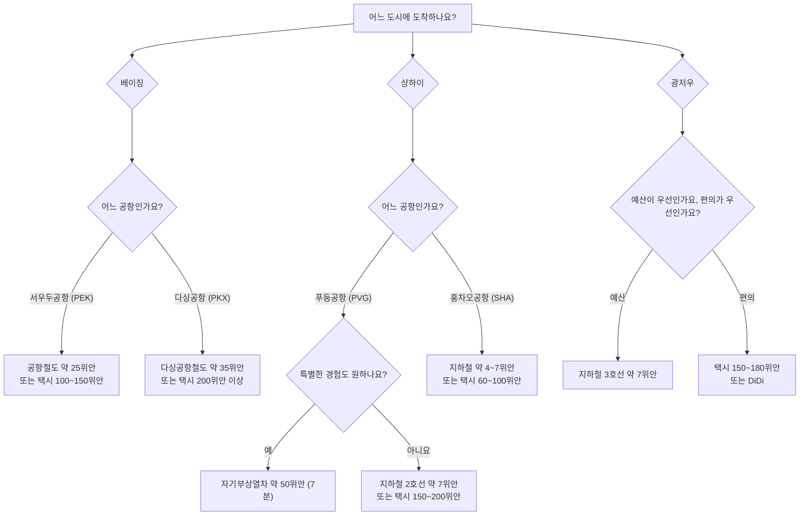

## Introduction

중국에 막 도착했을 때 가장 피곤한 순간은 입국장을 나와 호텔까지 어떻게 가야 할지 멈춰 서는 때입니다. 베이징, 상하이, 광저우는 모두 공항 교통이 잘 갖춰진 도시라 선택지만 알면 이동 자체는 어렵지 않습니다. 핵심은 세 가지입니다. 얼마를 아끼고 싶은지, 얼마나 빨리 가야 하는지, 그리고 캐리어가 얼마나 무거운지입니다.

한국에서 인천공항철도, 김포공항 지하철, 심야 택시를 상황에 따라 고르듯이 중국에서도 비슷하게 생각하면 됩니다. 지하철과 공항철도는 저렴하고 정체가 없으며, 택시와 DiDi는 비싸지만 호텔 문 앞까지 갑니다. 아래에서는 2026년 기준으로 베이징, 상하이, 광저우 주요 공항별 이동 방법과 대략적인 요금, 결제 팁을 정리했습니다.

## Before You Begin

중국 공항 교통은 출발 전에 두 가지만 준비해 두면 훨씬 수월합니다.

첫째, 모바일 결제를 세팅하세요. 알리페이(Alipay)나 위챗페이(WeChat Pay)에 해외 카드를 연결해 두면 지하철 티켓, 공항철도, 차량 호출, 편의점 결제까지 대부분 해결됩니다. 특히 DiDi는 앱 안에서 목적지 입력과 결제가 끝나므로 기사에게 호텔 이름을 중국어로 설명해야 하는 부담이 줄어듭니다.

둘째, 비상용 현금을 조금 챙기세요. 대도시에서는 모바일 결제가 거의 표준이지만, 오래된 택시나 일부 자동판매기처럼 현금이 더 편한 상황이 아직 있습니다. 10위안, 20위안, 50위안 지폐를 섞어 두면 좋습니다. 원화 감각으로는 100위안이 대략 2만 원 전후라고 잡고 예산을 계산하면 편합니다.

> 주의: 출근 시간인 오전 7~9시, 퇴근 시간인 오후 5~8시에는 공항고속도로가 심하게 막힐 수 있습니다. 이 시간대에 도착한다면 택시보다 지하철이나 공항철도를 먼저 고려하세요. 서울에서 강남 방향 퇴근길 택시를 피하는 것과 비슷한 판단입니다.

도시별로 보면 선택은 더 간단해집니다.

## Beijing

베이징에는 큰 공항이 두 곳 있습니다. 이름보다 중요한 것은 위치입니다. 서우두공항은 비교적 도심 접근성이 좋고, 다싱공항은 남쪽으로 꽤 멀리 떨어져 있습니다.

**서우두공항(PEK)**은 오래전부터 베이징의 대표 관문 역할을 해 온 공항입니다. 시내로 들어갈 때 가장 무난한 선택은 공항철도입니다. 요금은 약 25위안, 한화로 대략 5,000원 안팎이며 20~30분이면 둥즈먼역 등 지하철 환승 지점에 도착합니다. 이후 목적지에 맞춰 지하철로 갈아타면 됩니다.

택시는 보통 100~150위안 정도입니다. 한국 돈으로는 대략 2만~3만 원대라고 생각하면 됩니다. 길이 막히지 않으면 40분 안팎에 도착할 수 있지만, 출퇴근 시간에는 1시간 이상 걸릴 수 있습니다. 짐이 많지 않고 목적지가 도심이라면 공항철도가 가격과 시간 면에서 가장 균형이 좋습니다.

**다싱공항(PKX)**은 시설은 새롭고 쾌적하지만 위치가 남쪽으로 멉니다. 거리 때문에 이동 수단 선택이 더 중요합니다. 다싱공항철도는 약 35위안으로 차오차오역 방향까지 빠르게 이동하며, 일부 구간은 고속철 연계도 가능합니다. 이후 지하철로 갈아타면 베이징 주요 지역으로 들어갈 수 있습니다.

반면 다싱공항에서 택시를 타면 200위안 이상 나오는 경우가 흔하고, 소요 시간도 1시간을 넘기기 쉽습니다. 늦은 밤 도착하거나 캐리어가 여러 개라면 택시나 DiDi가 편하지만, 낮 시간대에 혼자 또는 둘이 이동한다면 철도 이용이 훨씬 합리적입니다.

## Shanghai

상하이는 공항별 성격이 뚜렷합니다. 푸둥공항은 국제선 중심의 큰 공항이고, 훙차오공항은 도심에 가까운 교통 허브에 가깝습니다.

**푸둥공항(PVG)**에서 가장 유명한 선택지는 자기부상열차입니다. 푸둥공항에서 룽양루역까지 약 7~8분 만에 이동하며 요금은 약 50위안입니다. 같은 날 항공권을 제시하면 조금 할인되는 경우도 있습니다. 열차 자체가 여행의 작은 이벤트가 되기 때문에, 상하이가 처음이라면 한 번 타볼 만합니다. 다만 룽양루역에서 다시 지하철로 갈아타야 하므로 호텔 앞까지 한 번에 가는 수단은 아닙니다.

가장 저렴한 방법은 지하철 2호선입니다. 요금은 약 7~8위안, 한화로 1,500원 안팎입니다. 푸둥공항에서 시내 방향으로 이어지지만 이동 시간이 길어 60~90분을 잡는 것이 좋고, 구간에 따라 환승이 필요할 수 있습니다. 서울에서 공항철도 일반열차를 타고 도심까지 천천히 들어가는 느낌에 가깝습니다.

택시는 약 150~200위안 정도이며 보통 45~60분이 걸립니다. 호텔이 와이탄, 인민광장, 징안 등 중심 지역에 있고 캐리어가 무겁다면 택시나 DiDi가 편합니다. 정리하면, 경험과 속도는 자기부상열차, 예산은 지하철, 짐과 편의는 택시 또는 DiDi입니다.

**훙차오공항(SHA)**은 도심과 가까워 선택이 훨씬 편합니다. 지하철 2호선과 10호선이 연결되어 있고, 요금은 보통 4~7위안 수준입니다. 인민광장, 난징시루, 신톈디 등 주요 지역으로 이동하기도 좋습니다.

택시 요금도 푸둥보다 부담이 적습니다. 목적지에 따라 대략 60~100위안 정도를 예상하면 됩니다. 한국에서 김포공항이 인천공항보다 도심 접근이 쉬운 것처럼, 상하이에서는 훙차오공항이 이동 피로가 적은 편입니다.

## Guangzhou

**광저우 바이윈공항(CAN)**은 지하철 3호선으로 시내와 연결됩니다. 요금은 약 7위안, 한화로는 1,500원 안팎이며, 시내 중심부까지 대략 50~70분 정도 걸립니다. 가장 큰 장점은 도로 정체와 무관하다는 점입니다. 광저우는 비가 오거나 출퇴근 시간이 겹치면 도로 흐름이 꽤 느려질 수 있어, 도착 시간을 예측해야 한다면 지하철이 유리합니다.

택시는 보통 150~180위안 정도이고, 교통 상황에 따라 40~60분 정도 걸립니다. DiDi도 비슷하거나 조금 저렴할 수 있습니다. 늦은 밤 도착했거나 숙소가 지하철역에서 멀다면 차량 호출이 편하지만, 낮 시간대에 중심부로 이동한다면 지하철 3호선이 가장 안정적인 선택입니다.

<!-- AFFILIATE_TRAVEL -->

## How to Choose and Pay

세 도시를 통틀어 선택 기준은 단순합니다.

1. **짐이 가볍고 예산을 아끼고 싶다면:** 지하철이나 공항철도를 타세요. 가장 저렴하고 도로 정체의 영향을 받지 않습니다. 베이징, 상하이, 광저우 모두 공항에서 철도 연결이 잘 되어 있습니다.

2. **캐리어가 크거나, 밤늦게 도착했거나, 여러 명이 함께 이동한다면:** 택시나 DiDi가 편합니다. 혼자 타면 비싸지만 3~4명이 나누면 1인당 부담은 꽤 낮아집니다. 가족 여행이나 부모님 동반 여행이라면 도어 투 도어 이동의 가치가 큽니다.

3. **상하이에서 빠르고 독특한 경험을 원한다면:** 푸둥공항 자기부상열차를 고려해 보세요. 최종 목적지까지 한 번에 가는 수단은 아니지만, 짧은 시간에 상하이 여행의 인상을 확실히 남깁니다.

결제는 가능한 한 모바일 지갑을 사용하세요. 지하철 발권기와 개찰구는 알리페이와 위챗페이 QR 결제를 지원하는 곳이 많고, DiDi는 앱에 연결한 카드나 지갑으로 자동 결제됩니다. 택시는 모바일 결제와 현금을 모두 준비해 두면 마음이 편합니다. 중국 여행에서는 "모바일 결제 하나, 소액 현금 조금" 조합이 가장 실용적입니다.

## Read Next

- [Beijing Daxing airport transfer guide](/posts/beijing-daxing-airport-to-city-center-a-first-timer-s-guide/)
- [Shanghai metro guide for foreigners](/posts/shanghai-metro-for-foreigners-tickets-qr-codes-transfers/)
- [DiDi China guide for tourists](/posts/didi-china-foreign-tourists-guide/)

## Summary

베이징, 상하이, 광저우는 모두 공항에서 시내까지 가는 방법이 비교적 명확합니다. 베이징 서우두공항에서는 약 25위안의 공항철도가 빠르고 경제적이며, 멀리 있는 다싱공항에서는 약 35위안의 다싱공항철도가 택시보다 비용 대비 효율이 좋습니다. 상하이 푸둥공항에서는 약 50위안의 자기부상열차가 빠르고 재미있는 선택이고, 지하철 2호선은 가장 저렴합니다. 훙차오공항은 도심과 가까워 지하철이나 택시 모두 부담이 적습니다. 광저우 바이윈공항에서는 약 7위안의 지하철 3호선이 시간 예측 면에서 가장 안정적입니다.

전체적으로 보면 철도는 싸고 정확하며, 택시와 DiDi는 비싸지만 편합니다. 출국 전 알리페이 또는 위챗페이를 세팅하고, 100위안 안팎의 현금을 비상용으로 준비한 뒤, 짐의 양과 도착 시간에 맞춰 고르면 됩니다.
