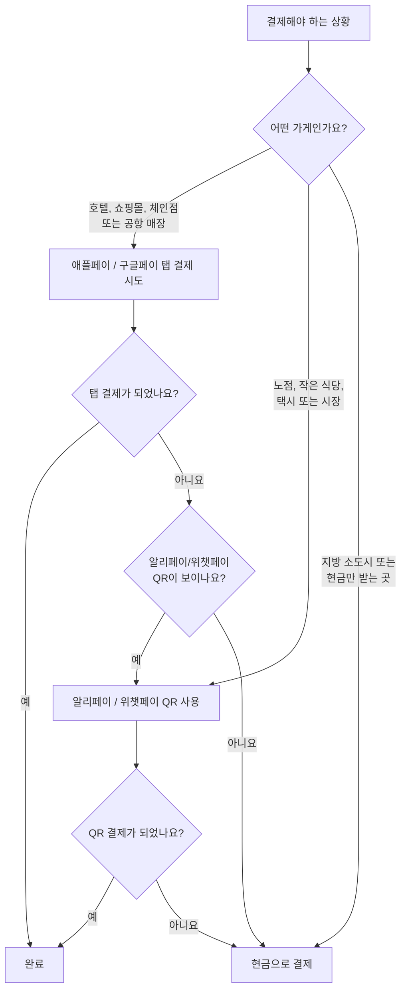

## 소개

짧게 말하면, 중국에서 휴대폰을 단말기에 대고 결제하는 방식은 주류가 아닙니다. 한국에서 삼성페이나 애플페이를 쓰듯 계산대에 휴대폰을 갖다 대면 끝날 것 같지만, 중국의 일상 결제는 거의 알리페이와 위챗페이 QR 코드로 움직입니다.

그렇다고 애플페이나 구글페이가 완전히 쓸모없다는 뜻은 아닙니다. 대형 호텔, 쇼핑몰, 공항 매장, 일부 지하철처럼 해외 비접촉 카드를 받는 곳에서는 꽤 편합니다. 문제는 그 범위를 벗어나면 갑자기 아무것도 안 되는 순간이 온다는 점입니다. 명동이나 강남의 대형 매장에서는 카드가 자연스럽지만, 골목 분식집이나 전통시장에서는 다른 방식이 필요한 것과 비슷하게 생각하면 이해가 쉽습니다.

## 시작하기 전에

가장 먼저 알아둘 점은 애플페이와 구글페이가 독립적인 결제망이 아니라는 것입니다. 휴대폰 안에 넣어 둔 카드, 보통 Visa나 Mastercard, 경우에 따라 American Express를 단말기가 비접촉 방식으로 받아줘야 결제가 됩니다.

중국은 카드 단말기를 촘촘하게 깔기보다 알리페이와 위챗페이 QR 결제로 빠르게 넘어간 나라입니다. 그래서 한국에서처럼 카드 리더기에 휴대폰을 대는 환경을 기대하면 불편해집니다. 특히 식당, 카페, 택시, 시장처럼 여행자가 자주 가는 곳일수록 QR 결제가 기본입니다.

### 휴대폰 탭 결제가 비교적 잘 되는 곳

- **국제 브랜드 호텔과 비즈니스 호텔**의 프런트 데스크
- **상하이, 베이징 같은 1선 도시의 대형 백화점과 쇼핑몰**
- **체인 슈퍼마켓과 편의점** 일부 지점
- **공항 매장, 면세점, 주요 교통 허브**의 일부 매장
- **상하이, 베이징, 광저우, 선전 등 일부 도시의 지하철 개찰구**

이런 곳은 외국인 손님이 많고 해외 카드 결제 경험도 상대적으로 많습니다. 서울역, 인천공항, 대형 호텔 로비처럼 외국인 결제에 익숙한 장소라고 보면 됩니다.

### 거의 안 된다고 보는 편이 나은 곳

- 길거리 음식 노점, 재래시장, 가족이 운영하는 작은 식당
- 대부분의 일반 택시와 QR 결제를 선호하는 호출 차량 기사
- 개인 상점, 찻집, 동네 카페, 지방 소도시의 가게
- 중국 국내 QR 결제만 염두에 둔 자판기와 티켓 발권기

계산대에 QR 코드 스티커만 붙어 있고 카드 단말기가 보이지 않는다면 애플페이를 시도해도 소용없는 경우가 많습니다. 이럴 때는 바로 알리페이나 위챗페이로 넘어가는 편이 빠릅니다.

### 애플페이와 구글페이의 현실적인 차이

**애플페이**는 여행자 입장에서 둘 중 더 믿을 만합니다. 출국 전에 한국에서 적격 Visa, Mastercard, American Express 카드를 등록해 두면, 실제 탭 결제 과정 자체는 구글 서비스처럼 중국에서 막히는 서비스에 의존하지 않습니다. 단말기가 해외 비접촉 카드를 받기만 하면 결제 가능성이 있습니다.

**구글페이, 즉 Google Wallet**은 조금 더 조심해야 합니다. 탭 결제 원리는 카드망을 쓰기 때문에 비접촉 단말기에서는 작동할 수 있지만, 중국 본토에서는 구글 서비스가 차단됩니다. 현지에 도착한 뒤 카드를 새로 추가하거나 재인증하거나 앱 문제를 해결하려고 하면 막힐 수 있습니다. 한국에서 비행기 타기 전에 카드 등록과 은행 인증을 모두 끝내 두고, 현지에서는 비상용 정도로 생각하세요.

### 실제 여행을 편하게 만드는 조합

중국 결제 준비의 핵심은 비접촉 결제보다 QR 결제입니다. 출국 전에 **알리페이** 또는 **위챗페이**를 설치하고 해외 Visa나 Mastercard를 연결해 두세요. 이 두 앱은 외국인 여행자도 QR 코드로 결제할 수 있게 지원하며, 애플페이와 구글페이가 닿지 않는 대부분의 작은 매장까지 커버합니다.

추천 조합은 간단합니다. 알리페이 또는 위챗페이를 1순위로 쓰고, 애플페이는 호텔과 쇼핑몰, 지하철에서 보조로 쓰며, 몇백 위안의 현금을 마지막 안전장치로 들고 다니는 것입니다.

<!-- AFFILIATE_PAYMENT -->

## 단계별 준비

1. **출국 전에 한국 네트워크에서 카드를 등록하세요.** Visa, Mastercard, Amex를 애플페이 또는 Google Wallet에 넣고 은행의 1회용 인증번호, 앱 승인, 문자 인증까지 마쳐 두세요. 중국 도착 후 해결하려고 미루면 통신 환경이나 서비스 차단 때문에 번거로워질 수 있습니다.
2. **카드사 앱에서 해외 사용 상태를 확인하세요.** 낯선 국가에서 갑자기 탭 결제가 발생하면 부정 사용으로 막힐 수 있습니다. 여행 알림 기능이 있으면 등록하고, 해외 결제와 비접촉 결제가 켜져 있는지도 확인하세요.
3. **알리페이 또는 위챗페이에 같은 카드를 연결하세요.** 앱 안의 외국인 방문자 등록 흐름을 따라가면 됩니다. 중국에서는 이 QR 결제가 주 결제 수단이고, 애플페이는 보조 수단입니다. 가능하면 출국 전에 설정을 끝내는 편이 안정적입니다.
4. **도착 후 소액 현금을 준비하세요.** 공항 ATM에서 국제 카드망으로 위안을 인출할 수 있습니다. 200~500위안 정도를 작은 지폐로 가지고 있으면 택시, 지방 이동, 단말기 오류 상황에서 마음이 편합니다. 원화로는 대략 몇만 원 수준의 비상금이라고 생각하면 됩니다.
5. **계산대에서는 단말기와 QR부터 보세요.** 비접촉 결제 물결 표시가 있고 호텔, 쇼핑몰, 체인점, 슈퍼마켓이라면 휴대폰을 대볼 만합니다. 직원이 QR 스티커나 스캐너를 가리키면 애플페이를 고집하지 말고 알리페이나 위챗페이를 여세요.
6. **지하철은 개찰구 표시를 확인하세요.** 지원 도시에서는 개찰구에 비접촉 리더기가 있고, 애플페이에 등록한 카드로 통과할 수 있습니다. 해외 카드용 리더기가 보이지 않으면 1회권을 사거나 결제 앱의 교통 QR을 쓰세요.
7. **항상 대체 수단을 하나 더 남겨 두세요.** 휴대폰 배터리가 꺼질 수 있고, 단말기가 재부팅될 수 있으며, 네트워크가 순간적으로 끊길 수 있습니다. QR 앱, 애플페이, 현금 중 최소 두 가지는 바로 쓸 수 있게 준비하는 것이 좋습니다.

## 피해야 할 흔한 실수

- **내 카드가 비접촉 카드니까 어디서나 될 거라고 생각하기.** 카드 기능이 있어도 가게에 그 카드를 읽는 단말기가 없으면 결제할 수 없습니다. 중국의 작은 상점 상당수는 그런 단말기가 없습니다.
- **구글페이를 주 결제 수단으로 잡기.** 중국에서는 구글 서비스 접속이 막혀 카드 추가, 재인증, 문제 해결이 어려울 수 있습니다. 출국 전에 설정을 끝내고, 현지에서는 보조 수단으로만 기대하세요.
- **알리페이나 위챗페이를 건너뛰기.** 가장 큰 실수입니다. QR 결제 앱이 없으면 길거리 음식, 작은 식당, 시장, 생활형 매장에서 결제가 막힐 가능성이 큽니다.
- **카드사에 해외 사용 가능 여부를 확인하지 않기.** 부정 사용 의심으로 카드가 잠기면 첫날부터 결제 계획이 꼬입니다.
- **현금을 전혀 들고 다니지 않기.** QR과 비접촉 결제도 가끔 실패합니다. 특히 지방이나 작은 가게에서는 소액 현금이 여전히 쓸모 있습니다.
- **한 가지 결제 수단만 믿기.** 중국 여행 결제의 핵심은 중복 준비입니다. QR 앱이 1순위, 애플페이가 2순위, 현금이 3순위라고 생각하면 가장 안정적입니다.

> **주의:** 중국의 작은 상점 대부분은 NFC 탭 결제를 받는 단말기가 없습니다. 계산대에 QR 코드만 붙어 있다면 애플페이를 계속 시도하기보다 알리페이나 위챗페이를 여는 것이 훨씬 빠릅니다.

> **현실적인 팁:** 구글페이는 중국에서 취약한 예비 수단입니다. 구글 서비스 차단 때문에 현지에서 거래 내역 확인, 카드 재인증, 앱 문제 해결이 어려울 수 있으니 출국 전에 모든 설정을 끝내고 마지막 백업으로만 보세요.

## 요약

중국에서 애플페이는 분명 도움이 됩니다. 다만 주로 호텔, 쇼핑몰, 체인 매장, 공항, 일부 지하철 개찰구처럼 해외 비접촉 카드를 받는 곳에서만 기대할 수 있습니다. 구글페이도 같은 조건에서 작동할 수 있지만, 중국 본토의 구글 서비스 차단이라는 추가 리스크가 있습니다.

여행자의 주력 결제 수단은 해외 카드를 연결한 알리페이 또는 위챗페이입니다. 중국의 대부분 가게는 QR 결제에 맞춰져 있으므로 이 두 앱 중 하나가 있어야 식당, 시장, 카페, 택시에서 훨씬 편합니다. 여기에 애플페이를 보조로 두고, 몇백 위안의 현금을 챙기면 상하이 도심부터 지방 이동까지 대부분의 상황을 무리 없이 넘길 수 있습니다.

## 다음 글

- [중국 여행자를 위한 모바일 결제 가이드](/posts/how-to-pay-in-china-tourist-guide/)
- [해외 카드를 알리페이에 연결하는 방법](/posts/alipay-foreign-credit-card-step-by-step/)
- [중국에서 해외 신용카드를 바로 쓸 수 있는 곳](/posts/use-foreign-credit-card-in-china-directly/)
