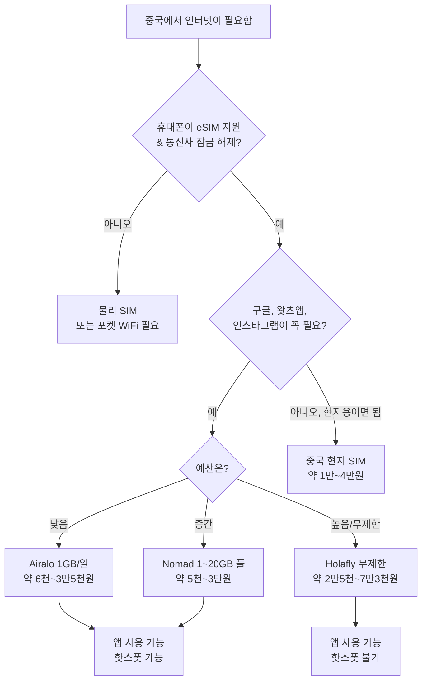

## 소개

중국에 도착하자마자 휴대폰이 먹통이면 생각보다 피로가 큽니다. 12시간 넘는 비행 끝에 내려서 택시를 잡고, 호텔에 연락하고, 지도를 켜야 하는데 국내 통신사 로밍은 너무 비싸거나 아예 안 되는 경우가 많기 때문입니다. 거기에다 인터넷이 연결되더라도 평소 쓰던 앱이 바로 안 열리면 더 답답해집니다.

처음 중국을 가는 사람에게 특히 낯선 건 두 번째 문제입니다. 중국 본토 망은 글로벌 인터넷 일부를 차단하기 때문에, 현지 SIM을 사면 구글 지도나 메신저, SNS가 막혀 있는 느낌을 받을 수 있습니다. 반대로 제대로 고른 eSIM은 이 두 가지를 한 번에 해결합니다. 도착 즉시 연결되고, 잘 만든 여행용 eSIM은 평소 쓰던 앱도 그대로 열리게 해줍니다. 이 글에서는 어떤 요금제를 골라야 하는지, 그리고 현지에서 헤매지 않도록 어떻게 세팅해야 하는지 차근차근 정리합니다.

> **핵심:** 구글 지도, 왓츠앱, 인스타그램이 중요하다면 중국 현지 통신망에 직접 붙는 SIM은 피하고, Airalo, Holafly, Nomad 같은 여행용 eSIM을 고르는 편이 낫습니다. 이런 상품은 홍콩이나 해외망을 경유해 들어오므로, 입국 후에도 별도 VPN 없이 평소 앱을 쓰기 쉽습니다.

## 시작하기 전에

돈을 쓰기 전에 먼저 내 휴대폰이 eSIM을 실제로 쓸 수 있는지부터 확인해야 합니다. 조건은 두 가지입니다.

첫째, 기기에 eSIM 기능이 있어야 합니다. 아이폰 XS, XR 이후 모델, 최근 구글 픽셀, 플래그십 삼성 갤럭시는 대부분 지원합니다. 가장 빠른 확인 방법은 설정에서 'eSIM 추가'나 '요금제 추가' 메뉴를 찾는 것입니다. 메뉴가 보이면 대체로 문제 없습니다. 다만 중국 본토에서 판매된 일부 기기는 같은 모델이라도 eSIM이 비활성화돼 있을 수 있습니다.

둘째, 통신사 잠금이 풀려 있어야 합니다. 약정이나 할부로 산 폰은 원래 통신사에 묶여 있을 수 있고, 그러면 외부 eSIM이 막힙니다. 출국 전에 통신사에 잠금 해제 여부를 확인하세요. 공항에서 막히는 것보다 집에서 정리하는 편이 훨씬 낫습니다.

가능하면 기기 모델명, OS 버전도 메모해 두고, 설치할 때 쓸 와이파이도 확보해 두세요. eSIM 프로필 설치에는 인터넷 연결이 필요하므로, 집에서 미리 해두는 편이 현장에서 공항 와이파이를 찾는 것보다 훨씬 덜 번거롭습니다.

> **주의:** 공항에 도착해서 eSIM을 설치하지 마세요. 많은 eSIM 요금제는 '설치 시점'이 아니라 '첫 네트워크 연결'부터 유효기간을 계산합니다. 한국에서 미리 프로필만 넣어두고 데이터 로밍은 꺼둔 채 들어가면, 현지에서 시작일을 온전히 쓸 수 있습니다. 상품 설명이 애매하면 기본값은 '도착 후 활성화'로 생각하는 게 안전합니다.

## 중국 eSIM 고르는 법

중국용 eSIM은 전부 같지 않습니다. 다른 나라보다 차이가 실제 체감에 더 크게 나타나니, 아래 기준을 같이 봐야 합니다.

### 검열 우회 여부

중국에서 제일 중요한 기준입니다. 중국 여행용으로 팔리는 eSIM 상당수는 중국 본토 망에 직접 붙지 않고, 제휴망을 거쳐 홍콩이나 다른 해외 거점으로 데이터를 보냅니다. 트래픽이 본토 필터 밖으로 빠지기 때문에, 평소 쓰던 앱이 별도 설정 없이 열리는 경우가 많습니다.

반대로 일부 요금제는 중국 본토망에 연결되면서 국내 SIM과 비슷한 제한을 그대로 받습니다. 상품 설명에서 '제한 없는 접속'이나 '해외망 로밍' 같은 표현이 있는지 꼼꼼히 보세요. 설명이 거의 없고 가격만 지나치게 싸면, 현지망을 타는 상품일 가능성을 의심해야 합니다.

### 데이터 용량과 유효기간

요금제는 보통 세 가지로 나뉩니다. 하루 1GB씩 주는 일일형, 여행 기간 전체에서 나눠 쓰는 총량형, 그리고 속도 제한이 걸릴 수 있는 무제한형입니다. 일정이 예측 가능하고 사용량이 적당하면 일일형이 편하고, 날짜별 편차가 크면 총량형이 유리합니다. 지도, 메신저, 호출 앱, 번역, SNS 정도를 쓰는 1~2주 여행이라면 하루 1~2GB를 기준으로 잡으면 됩니다. 영상이 많거나 테더링을 자주 쓰면 그보다 더 필요하니, 그럴 땐 무제한이나 고용량이 낫습니다.

유효기간이 언제부터 시작되는지도 꼭 봐야 합니다. 설치한 순간부터 계산되는 상품도 있고, 첫 접속부터 시작되는 상품도 있습니다. 이 차이 하나 때문에 언제 활성화할지 달라집니다.

### 가격과 통신망 커버리지

가격은 데이터량과 기간에 따라 오르지만, 가장 싼 상품이 항상 이득은 아닙니다. 현지망을 타거나 속도가 들쑥날쑥하면 여행 내내 스트레스만 커집니다. 도시와 이동 구간 모두에서 커버리지가 안정적인 네트워크를 쓰는 eSIM이 낫습니다. 일정에 지방 소도시나 장거리 이동이 들어간다면, 실제로 그 지역까지 닿는지 확인하세요. 최근 이용자 후기를 보는 것도 꽤 중요합니다. 몇 분만 투자해도 실제 속도와 안정성을 가늠할 수 있습니다.

### 2026년 통신사 비교

| 통신사 | 데이터 요금제 | 가격(대략) | 유효기간 | 검열 우회? | 핫스폿 | 추천 대상 |
|----------|-----------|----------------|----------|------------------|---------|----------|
| **Airalo** | 1GB/일 또는 1~20GB 총량형 | 약 6천~3만5천원 | 7~30일 | 예(HK/아시아 경유) | 예 | 예산형, 가벼운 사용 |
| **Holafly** | 무제한(일일 약 1GB 이후 속도 제한 가능) | 약 2만5천~7만3천원 | 5~30일 | 예 | 아니오 | 많이 쓰는 사람, 단순한 요금제 선호 |
| **Nomad** | 1~20GB 총량형 | 약 5천~3만원 | 7~30일 | 예 | 예 | 중간 예산, 유연한 사용량 |
| **중국 모바일(현지)** | 공항 현지 SIM | 약 1만~4만원 | 7~30일 | 아니오, 일반적인 GFW 적용 | 예 | 장기 체류, GB당 단가 중시 |
| **Google Fi** | 기본요금 + GB당 과금 | 월 2만7천원+ 데이터 | 월 단위 | 예 | 예 | 중국을 자주 가는 사람 |

**한 줄 결론:** 짧은 여행이라면 Airalo와 Nomad가 가성비가 좋습니다. 데이터 신경 쓰기 싫으면 Holafly의 무제한이 편합니다. 세 여행용 eSIM 모두 콘텐츠 제한을 우회하므로 구글, 왓츠앱, 인스타그램을 별도 VPN 없이 쓰기 쉽습니다. 반대로 중국 현지 SIM은 자유로운 인터넷이 필요할 때 피하는 편이 낫습니다.

정리하면, 검열 우회형 요금제는 조금 더 비싸고 지연이 약간 늘 수 있지만, 현지에서 VPN 붙잡고 씨름하는 시간을 줄여줍니다. 대부분의 여행자에게는 그 편의성이 충분히 값어치를 합니다.

<!-- AFFILIATE_ESIM -->

## 단계별 설정 방법

구매부터 연결 확인까지의 전체 흐름은 이렇습니다.

1. **출국 전에 먼저 구매하세요.** 집에서 와이파이가 안정적일 때 신뢰할 수 있는 업체에서 미리 사두는 게 좋습니다. 보통 이메일로 몇 분 안에 eSIM 정보가 도착합니다.

2. **QR 코드를 받으세요.** 업체는 보통 QR 코드와 함께 수동 입력용 활성화 코드를 보냅니다. 이메일은 지우지 말고, 오프라인에서도 볼 수 있게 캡처해 두세요.

3. **eSIM 프로필을 설치하세요.** 아이폰은 설정 > 셀룰러(또는 모바일 서비스) > eSIM 추가로 들어가 QR 코드를 스캔하면 됩니다. 안드로이드는 설정 > 네트워크 및 인터넷 > SIM으로 들어가 다운로드한 SIM을 추가하세요. 이 작업은 한국에서 와이파이로 해두는 게 좋습니다. 설치는 프로필 다운로드일 뿐, 항상 요금제가 바로 시작되는 것은 아닙니다.

4. **회선을 구분해 이름을 붙이세요.** 설치가 끝나면 회선이 두 개가 됩니다. '한국 번호', '중국 데이터'처럼 이름을 바꿔두면 나중에 헷갈리지 않습니다.

5. **활성화 시점을 정하세요.** 유효기간이 설치 시점부터 시작되는 상품이라면 출발 직전에 켜면 됩니다. 첫 네트워크 연결부터 시작되는 상품이 더 흔하니, 그런 경우에는 도착 전까지 데이터 로밍을 꺼두세요.

6. **도착 후 데이터 로밍을 켜세요.** 중국에 내리면 셀룰러 설정에서 중국 eSIM 회선을 선택하고 데이터 로밍을 켭니다. 처음 보면 이상하지만, 여행용 eSIM은 기술적으로 파트너망에 로밍하는 방식이라 이 스위치가 있어야 데이터가 흘러갑니다.

7. **기본 데이터 회선으로 설정하세요.** 셀룰러 설정에서 중국 eSIM을 모바일 데이터 기본 회선으로 지정합니다. 통화와 문자는 한국 회선을 그대로 써도 되지만, 한국 회선의 데이터 로밍은 꺼 두는 편이 좋습니다.

8. **연결을 확인하세요.** 와이파이를 잠깐 끄고 지도 앱이나 웹페이지를 열어 데이터가 들어오는지 확인합니다. 평소 쓰던 앱이 VPN 없이 열리면, 우회형 요금제가 제 역할을 하는 것입니다.

## 자주 생기는 문제 해결

도착했는데 신호가 없다면 일단 단순한 것부터 확인하세요. 비행기 모드를 껐다 켜서 휴대폰이 다시 망을 찾게 합니다. 그다음 eSIM 회선에 데이터 로밍이 실제로 켜져 있는지, 기본 모바일 데이터 회선으로 선택돼 있는지 확인하세요. 이 두 가지를 놓치는 경우가 가장 많습니다.

그래도 연결이 안 되면 셀룰러 설정에서 통신사 선택을 자동에서 수동으로 바꾸고, 목록에 뜨는 망 중 하나를 직접 골라보세요. 자동 선택이 파트너망을 제대로 붙잡지 못하는 경우가 가끔 있습니다.

속도가 느리면 커버리지 문제일 수도 있고, 무제한 요금제의 고속 구간을 다 써서 제한이 걸린 것일 수도 있습니다. 위치를 옮겨 보거나 남은 고속 데이터가 있는지 확인하면 원인이 구분됩니다.

데이터는 되는데 평소 앱만 안 열리면, 현지망으로 우회되는 상품을 산 가능성이 큽니다. 이 경우에는 출국 전에 설치해 둔 신뢰할 수 있는 VPN이 대안이 됩니다. 그래서 처음부터 검열 우회형 eSIM을 고르는 게 중요합니다.

마지막으로 프로필 자체가 안 깔리면 와이파이 연결 상태, 통신사 잠금 해제 여부, QR 코드의 일회성 사용 여부를 확인하세요. 대부분의 여행용 eSIM 업체는 채팅으로 24시간 지원을 제공합니다.

## 다음 글

- [eSIM vs roaming cost breakdown](/posts/china-esim-vs-roaming-2026-the-real-10-day-cost/)
- [Pocket WiFi vs eSIM vs local SIM](/posts/pocket-wifi-vs-esim-vs-sim-china/)
- [internet access and apps that work in China](/posts/internet-access-china-apps-that-work-2026/)

## 요약

중국에서 가장 깔끔하게 연결을 유지하는 방법은 eSIM입니다. 다만 무엇을 고르느냐에 따라 여행이 편해질 수도, 답답해질 수도 있습니다. 먼저 휴대폰이 eSIM을 지원하고 통신사 잠금이 풀려 있는지 확인하세요. 요금제를 고를 때는 평소 앱이 계속 열리도록 검열 우회형을 우선하고, 그다음에 데이터 용량, 유효기간, 가격, 커버리지를 일정에 맞춰 비교하면 됩니다. 프로필은 집에서 와이파이로 미리 설치하고, 유효기간이 첫 연결부터 시작되는 상품이라면 도착 전까지 데이터 로밍은 꺼두세요. 중국에 도착하면 eSIM을 데이터 회선으로 지정하고, 공항을 나오기 전에 한 번 더 연결을 확인하면 됩니다. 이 순서만 지키면 인천공항에서처럼 바로 지도, 메신저, SNS를 쓰면서 움직일 수 있습니다.
