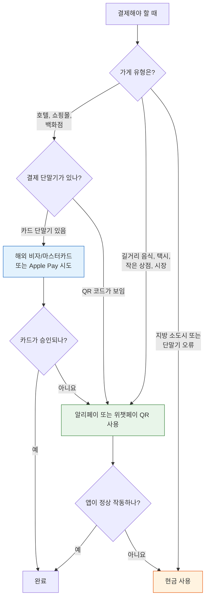

중국에서 어떻게 결제해야 하는지는 출발 전 가장 많이 헷갈리는 부분입니다. 한국도 카카오페이, 네이버페이, 삼성페이에 익숙하지만, 중국은 그보다 한 단계 더 모바일 중심입니다. 식당 계산대, 택시, 박물관 매표소, 길거리 간식 노점까지 QR 코드가 기본이고, 실물 카드는 생각보다 자주 거절됩니다.

다행히 2026년 현재는 외국인 여행자도 훨씬 쉽게 결제할 수 있습니다. 핵심은 출국 전에 알리페이와 위챗페이를 설치하고, 한국에서 쓰는 해외 결제 가능 카드를 연결해 두는 것입니다. 아래 순서대로 준비하면 상하이 번화가부터 베이징 골목 식당까지 대부분의 상황을 무리 없이 처리할 수 있습니다.

## 중국이 모바일 결제 중심 국가인 이유

지난 10여 년 동안 중국은 현금과 카드 단계를 빠르게 건너뛰고 스마트폰 결제 중심으로 이동했습니다. 그 중심에는 **Alipay**와 **WeChat Pay**가 있습니다. 현지인은 가게 QR 코드를 스캔하거나 자신의 결제 QR을 보여주고, 몇 초 만에 결제를 끝냅니다.

예전에는 이 구조가 외국인에게 큰 장벽이었습니다. 중국 은행 계좌가 있어야 지갑 기능을 제대로 쓸 수 있었기 때문입니다. 지금은 상황이 달라졌습니다. 알리페이와 위챗페이 모두 해외 방문객이 비자, 마스터카드 등 주요 해외 카드를 직접 연결할 수 있게 했습니다. 그래서 2026년에 중국을 여행한다면, 몇 년 전 후기만 보고 "외국인은 결제가 어렵다"고 걱정할 필요는 줄었습니다.

> **출발 전 준비 팁:** 알리페이와 위챗페이는 한국에서 미리 설치하고 인증까지 끝내는 것이 좋습니다. 여권 사진 업로드와 얼굴 인증이 필요할 수 있는데, 공항 Wi-Fi나 현지 로밍이 불안정한 상태에서 처음 설정하려면 시간이 꽤 걸릴 수 있습니다.

## 출발 전 준비할 것

중국에 도착해서 계산대 앞에서 앱을 설치하는 것은 피하는 편이 좋습니다. 한국에서 아래 항목을 미리 준비해 두세요.

- **스마트폰**: 알리페이와 위챗페이를 모두 설치할 수 있을 만큼 저장공간이 필요합니다.
- **여권**: 지갑 앱 안에서 본인 인증을 할 때 여권 정보와 사진이 사용됩니다.
- **해외 결제 가능한 신용카드 또는 체크카드**: 비자와 마스터카드가 가장 무난합니다. 해외 결제 수수료가 낮은 카드라면 더 좋습니다.
- **도착 후 바로 쓸 데이터 연결**: 로밍이나 중국 사용 가능 eSIM을 준비하면 인증 문자 확인, QR 결제, 지도 앱 사용이 훨씬 편합니다.

## 결제수단 3가지, 우선순위별 정리

### 1순위: 모바일 지갑(Alipay & WeChat Pay) - 기본 결제수단

중국 여행 결제의 약 90%는 이 두 앱으로 해결한다고 생각하면 됩니다. 한국 카드 정보를 연결하는 데 앱당 보통 10분 안팎이 걸립니다.

**설정 순서:**

1. **앱을 미리 다운로드합니다.** 출국 전 한국 앱스토어에서 Alipay와 WeChat을 설치하세요. 두 앱 모두 해외에서 받을 수 있습니다.
2. **휴대폰 번호로 가입합니다.** 한국 번호를 입력하고 문자 인증번호를 확인하면 됩니다. 중국 번호는 필요하지 않습니다.
3. **결제 또는 지갑 메뉴로 들어갑니다.** Alipay에서는 카드 또는 계정 결제 메뉴를 찾고, WeChat에서는 Me -> Services -> Wallet 순서로 이동합니다.
4. **해외 은행 카드를 추가합니다.** 카드 앞면에 적힌 이름, 번호, 유효기간을 그대로 입력합니다.
5. **본인 인증을 완료합니다.** 여권 사진을 올리고 얼굴 인증을 진행합니다. 규정상 필요한 1회성 절차입니다.
6. **도착 후 소액 결제를 테스트합니다.** 편의점 생수나 커피처럼 5~20위안(약 1천~4천원)짜리 결제를 먼저 해 보면 앱과 카드가 정상 작동하는지 확인할 수 있습니다.

**실제 결제 방법:** 가게 직원이 스캐너를 들고 있으면 내 결제 QR 코드를 보여주면 됩니다. 계산대에 QR 코드가 붙어 있으면 앱의 "Scan" 기능으로 코드를 찍고 금액을 입력한 뒤 비밀번호나 얼굴 인증으로 확인합니다. 한국의 간편결제보다 "QR을 직접 찍는" 상황이 더 많다고 생각하면 이해하기 쉽습니다.

### 2순위: 해외 실물 카드 - 쓸 만한 예비수단

해외 비자와 마스터카드를 받는 곳은 확실히 늘었습니다. 공항, 고급 호텔, 대형 쇼핑몰, 백화점, 글로벌 체인 매장에서는 실물 카드를 시도해 볼 만합니다. 상하이의 대형 몰이나 베이징 중심부 호텔에서는 카드 단말기가 준비된 곳도 많습니다.

하지만 실물 카드를 주 결제수단으로 믿고 가면 불편해질 수 있습니다. 동네 식당, 지하철 개찰구, 작은 카페, 노점은 카드 단말기보다 QR 결제를 당연하게 여깁니다. 카드는 "될 수도 있는 보조수단"으로 두고, 기본은 모바일 지갑으로 잡는 것이 현실적입니다.

### 3순위: 현금 - 마지막 안전망

중국 위안화 현금은 법정화폐라 가맹점이 받아야 합니다. 다만 현장에서 디지털 결제에 너무 익숙해져 있어 거스름돈이 부족하거나 현금 계산을 번거로워하는 경우가 있습니다. 그래도 몇백 위안, 한국 돈으로 대략 5만~10만원 정도는 작은 지폐로 갖고 있으면 안심됩니다.

현금은 통신이 약한 지방 지역, 결제 단말기 고장, 교통카드 충전기, 일부 오래된 매표소에서 도움이 됩니다. 인출은 ICBC, Bank of China 같은 대형 은행 ATM을 이용하는 편이 낫습니다. 출국 전 카드사 앱에서 해외 사용 차단이 걸려 있지 않은지도 확인하세요.

## 수수료 이해하기

중국에서 결제할 때 비용은 크게 세 가지로 나뉩니다.

- **지갑 앱 처리 수수료**: 일정 금액 이상 결제할 때 알리페이나 위챗페이가 약 3% 안팎의 수수료를 붙일 수 있습니다. 과거 기준으로는 200위안(약 3만8천원) 초과 결제에서 자주 언급됐고, 소액 결제는 무료인 경우가 많습니다.
- **카드사 해외 결제 수수료**: 한국 카드사가 부과하는 수수료입니다. 해외 결제 수수료가 낮은 카드를 고르면 체감 비용이 줄어듭니다.
- **ATM 인출 수수료**: 현금을 뽑을 때 현지 ATM 수수료와 한국 카드사 수수료가 함께 붙을 수 있습니다.

일상적인 여행 소비는 대부분 소액입니다. 아침 식사, 카페, 택시, 편의점 결제처럼 금액을 작게 나눠 쓰면 수수료 부담은 크지 않습니다. 호텔 보증금이나 고가 쇼핑처럼 큰 결제는 실물 카드가 되는지 먼저 확인하는 것도 방법입니다.

## 흔한 실수와 피하는 방법

- **도착해서 처음 설정하려고 하기**: 인증 문자, 여권 확인, 얼굴 인증이 한 번에 안 될 수 있습니다. 한국에서 안정적인 Wi-Fi로 끝내 두세요.
- **카드를 한 장만 가져가기**: 한 카드가 거절되거나 보안 차단이 걸리면 곤란합니다. 가능하면 다른 카드사나 다른 브랜드 카드 한 장을 예비로 챙기세요.
- **결제 한도 문제를 카드 차단으로 오해하기**: 지갑 앱이나 카드사가 1회 결제 한도를 제한할 수 있습니다. 큰 금액은 두 번으로 나누거나 실물 카드를 시도하세요.
- **현금을 아예 안 챙기기**: 한 번만 필요해도 그때는 현금이 큰 도움이 됩니다. 10위안, 20위안, 50위안권처럼 작은 지폐가 특히 편합니다.
- **로밍이나 eSIM을 늦게 켜기**: 데이터가 없으면 QR 스캔, 인증, 결제 확인이 모두 막힙니다. 공항 도착 직후 바로 연결되도록 준비하세요.

## 중국에서의 하루 결제 예시

아침에는 길거리 만두 가게에서 알리페이로 QR 코드를 스캔해 결제합니다. 점심 전에는 앱 안의 교통 QR로 지하철 개찰구를 통과합니다. 오후에는 박물관 입장권을 현장 QR 코드로 결제하고, 저녁에는 식당 계산서를 위챗페이로 나눠 냅니다. 밤에는 편의점이나 자판기에서 음료를 사며 다시 QR을 찍습니다.

이런 하루를 보내도 지갑에서 지폐를 꺼낼 일이 없을 수 있습니다. 한국에서도 현금을 잘 쓰지 않지만, 중국 대도시에서는 그 정도가 더 강합니다. "카드보다 QR이 먼저"라는 감각만 익히면 여행 동선이 훨씬 매끄러워집니다.

## 다음에 읽을 글

- [Alipay setup guide](/posts/alipay-foreign-credit-card-step-by-step/)
- [WeChat Pay setup guide](/posts/wechat-pay-foreign-visitors-guide/)
- [how much cash to bring](/posts/how-much-cash-to-bring-to-china/)

## 요약

2026년 중국 여행 결제의 핵심은 간단합니다. **출국 전에 알리페이와 위챗페이를 설치하고, 한국에서 쓰는 해외 결제 가능 카드를 연결해 두세요.** 호텔과 대형 매장용으로 실물 비자나 마스터카드를 챙기고, 예외 상황을 대비해 소액 현금을 준비하면 충분합니다.

이렇게 준비하면 중국 은행 계좌나 중국 휴대폰 번호 없이도 길거리 음식, 택시, 지하철, 박물관, 고속철 관련 결제까지 대부분 처리할 수 있습니다. 도착 후 첫날에 소액 결제로 한 번 테스트해 두면 그다음부터는 현지인처럼 자연스럽게 QR로 결제하게 됩니다.
