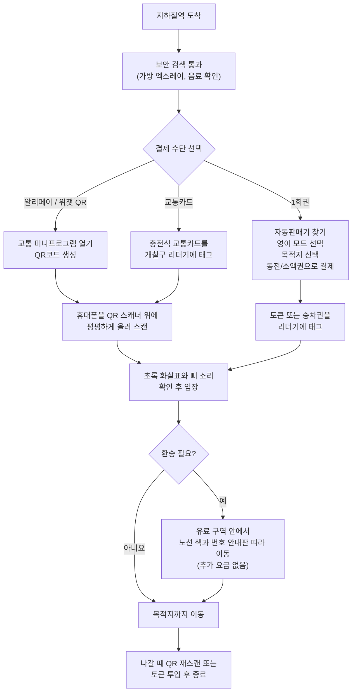

## 왜 중요할까요

상하이 지하철은 2,500만 명이 넘는 대도시를 여행할 때 가장 빠르고, 저렴하고, 예측 가능한 교통수단입니다. 노선은 20개가 넘고 역은 500개 이상이라 푸둥공항, 와이탄, 옛 프랑스 조계지, 주요 쇼핑가와 주거 지역 대부분을 지하철로 갈 수 있습니다. 서울에서 2호선과 공항철도, 주요 환승역을 조합해 움직이는 감각과 비슷하지만, 도시 규모가 훨씬 크기 때문에 교통 체증을 피하는 효과는 더 큽니다.

택시는 길이 막히면 시간이 크게 늘고, 기사와 영어로 소통하기도 쉽지 않습니다. 반면 지하철은 냉난방이 잘 되어 있고, 배차가 촘촘하며, 영어 표기가 비교적 잘 갖춰져 있습니다. 한국 여행자가 실제로 막히는 지점은 열차 자체가 아니라 "어떻게 결제하느냐"입니다.

중국은 현금보다 모바일 결제가 훨씬 보편적입니다. 예전처럼 종이 승차권을 사고 다니는 방식도 가능하지만, 현지인 대부분은 알리페이나 위챗의 교통 QR코드를 씁니다. 개찰구 앞에서 앱 설정을 하느라 뒤에 줄이 길어지는 상황을 피하려면, 첫 탑승 전에 결제 수단을 미리 준비해 두는 것이 좋습니다.

> 주의: QR코드가 잘 안 찍힐 때는 휴대폰 화면 밝기를 최대로 올리고, 화면을 스캐너 패드 위에 평평하게 대세요. 한국 지하철에서 교통카드를 살짝 태그하는 느낌으로 공중에 들고 있으면 인식이 잘 안 될 수 있습니다. 각도가 틀어졌거나 화면이 어두운 것이 가장 흔한 실패 원인입니다. 계속 실패하면 QR코드 화면을 닫았다가 다시 열어 새로고침하세요.

## 먼저 알아둘 것

상하이 지하철에서 여행자가 현실적으로 쓸 수 있는 결제 방법은 세 가지입니다. 체류 기간과 휴대폰 사용 방식에 따라 맞는 선택지가 조금씩 다릅니다.

- **알리페이 또는 위챗 QR코드**: 현지인이 가장 많이 쓰는 방식이며, 대부분의 단기 여행자에게도 가장 추천합니다. 앱에서 교통 QR코드를 열어 개찰구에 스캔하면 됩니다. 요금은 입장역과 퇴장역 기준으로 자동 계산됩니다.
- **1회권**: 역 자동판매기에서 사는 플라스틱 토큰 또는 카드형 승차권입니다. 휴대폰 배터리가 없거나 중국 앱을 설치하고 싶지 않을 때 쓸 수 있습니다. 탈 때마다 새로 사야 합니다.
- **상하이 공공교통카드**: 충전식 실물 교통카드입니다. 버스, 페리, 일부 택시에서도 쓸 수 있지만, 카드를 사고 충전해야 하므로 며칠 머무는 여행자보다는 장기 체류자에게 더 맞습니다.

### 여행 전에 모바일 결제 설정하기

가장 먼저 할 일은 **알리페이** 또는 **위챗페이**를 설치하고, 해외 발급 비자나 마스터카드를 연결해 두는 것입니다. 최근에는 두 앱 모두 외국인 카드 등록을 비교적 잘 지원합니다. 다만 역 개찰구 앞에서 처음 시도하지 말고, 호텔 와이파이에서 여권 인증과 카드 등록까지 미리 끝내 두세요.

- **알리페이**에서는 앱 안에서 "Metro" 또는 "Transport"를 검색하고, 도시를 상하이로 선택한 뒤 교통 QR코드를 활성화하면 됩니다.
- **위챗**에서는 "Ride Code" 또는 중국어 메뉴인 "乘车码"에서 상하이 지하철을 선택합니다.

주의할 점도 있습니다. 해외 카드는 카드사나 보안 설정에 따라 소액 결제가 거절되거나 인증 단계에서 막히는 경우가 있습니다. 한국에서 해외 온라인 결제를 막아 둔 카드라면 미리 풀어 두고, 가능하면 알리페이와 위챗 중 하나만이 아니라 둘 다 준비해 두면 현장에서 훨씬 덜 불안합니다.

<!-- AFFILIATE_TRAVEL -->

### 요금 계산 방식 이해하기

상하이 지하철 요금은 **거리 비례제**입니다. 가까운 구간은 **3위안**부터 시작하고, 이동 거리가 길어질수록 1위안 단위로 올라갑니다. 2026년 7월 기준 환율로 1위안은 약 220원 수준이라, 3위안은 약 660원, 9위안은 약 2,000원 정도로 생각하면 됩니다. 서울 지하철보다 복잡하게 보일 수 있지만, QR코드를 쓰면 금액을 직접 계산할 필요가 없습니다.

개찰구에 들어갈 때 한 번, 나올 때 한 번 스캔하면 시스템이 이동 거리를 계산해 자동으로 차감합니다. 그래서 목적지까지 얼마인지 미리 맞춰 충전하거나, 구간 요금을 외워 둘 필요는 없습니다.

## 실제 이용 순서

실제로 역 입구에서 승강장까지 가는 흐름은 다음과 같습니다.

1. **입구를 찾습니다.** 빨간색 지하철 로고, 즉 알파벳 M처럼 보이는 표지를 찾으면 됩니다. 큰 역은 출구 번호가 많으니, 나중에 나갈 출구 번호를 지도 앱에서 미리 확인해 두는 것이 좋습니다.
2. **보안 검색을 통과합니다.** 가방은 엑스레이 벨트에 올립니다. 절차는 빠르고 일상적입니다. 개봉된 생수나 음료를 들고 있으면 직원이 직접 마셔 보라고 할 수 있는데, 중국 지하철에서는 흔한 보안 절차입니다.
3. **개찰구로 들어갑니다.**
   - *QR코드*: 알리페이나 위챗에서 교통 QR코드를 열고, 화면 밝기를 높인 뒤 개찰구 위쪽의 기울어진 스캐너 패드에 휴대폰을 평평하게 댑니다. 삐 소리와 초록 화살표가 뜨면 들어가면 됩니다.
   - *1회권*: 먼저 자동판매기에서 승차권을 삽니다. 영어 모드로 바꾸고, 노선도에서 목적지 역을 고른 뒤 동전, 소액 지폐 또는 QR 결제로 결제합니다. 받은 토큰이나 카드를 개찰구 리더기에 태그합니다.
4. **노선 색과 번호를 따라갑니다.** 상하이 지하철은 각 노선에 번호와 색이 있습니다. 안내판에도 같은 색이 반복해서 표시되므로, 중국어를 읽지 못해도 번호와 색만 보고 이동할 수 있습니다.
5. **열차에 타고 정차역을 확인합니다.** 열차 안 화면과 안내 방송은 중국어와 영어가 함께 나옵니다. 문이 열리는 쪽도 화면이나 표시등으로 알려 주는 경우가 많습니다.
6. **필요하면 환승합니다.** 환승역에서는 다음 노선의 번호와 색을 따라 이동합니다. 유료 구역 안에서 이동하므로 개찰구를 나가지 않고, 추가 태그나 별도 결제도 하지 않습니다. 다만 일부 환승역은 지하 통로가 길어서 2~5분 정도 더 걸릴 수 있습니다.
7. **도착역에서 나갑니다.** 나갈 때 QR코드를 다시 스캔하거나, 1회권 토큰을 투입합니다. 거리 기준 요금은 이때 최종 확정됩니다. 1회권 토큰은 퇴장 개찰구에서 회수됩니다.

### 환승할 때 알아둘 점

상하이의 주요 환승역은 서울의 고속터미널역이나 종로3가역처럼 복잡하지만, 규모는 더 크게 느껴질 수 있습니다. 특히 인민광장역은 1호선, 2호선, 8호선이 만나는 중심 환승역이라 승강장 사이를 5분 가까이 걸을 수 있습니다.

이럴 때는 전체 노선도를 외우려고 하기보다 천장 안내판을 계속 따라가는 편이 낫습니다. "Line 2", "Line 8"처럼 영어와 숫자가 함께 표시되므로, 목적 노선 번호와 방향만 알고 있으면 길을 잃을 가능성이 크게 줄어듭니다.

## 문제 해결

**QR 스캐너가 휴대폰을 읽지 못합니다.** 화면 밝기를 최대로 올리고, 교통 QR코드 화면을 닫았다가 다시 열어 새로고침하세요. 휴대폰을 비스듬히 들지 말고 스캐너 패드에 평평하게 대는 것이 중요합니다. 금이 간 보호필름이나 너무 어두운 화면도 인식 실패의 원인이 됩니다.

**알리페이나 위챗에 해외 카드가 연결되지 않습니다.** 카드사에 따라 승인률이 다릅니다. 한 앱에서 안 되면 다른 앱을 시도해 보세요. 둘 다 실패하면 우선 현금으로 1회권을 사서 이동하고, 호텔이나 카페 와이파이에서 다시 인증을 진행하는 것이 낫습니다.

**들어갈 때는 찍었는데, 나가기 전에 휴대폰 배터리가 꺼졌습니다.** 개찰구 근처의 직원 창구로 가세요. 직원이 퇴장을 도와줄 수 있지만, 상황에 따라 최대 요금이 부과될 수 있습니다. 보조배터리와 소액 현금을 백업으로 챙겨 두면 이런 상황에서 편합니다.

**잘못된 노선을 탔습니다.** 유료 구역 안에 머무는 한 벌금이 붙지 않습니다. 다음 환승역까지 가서 반대 방향이나 올바른 노선으로 갈아타면 됩니다. 요금은 최종적으로 들어간 역과 나온 역 사이의 거리로 계산됩니다.

**출퇴근 시간이라 역이 너무 붐빕니다.** 평일 혼잡 시간은 대략 오전 7시 30분~9시 30분, 오후 5시 30분~7시 30분입니다. 열차가 몇 분 간격으로 자주 오므로, 너무 꽉 찬 열차는 한 대 보내는 편이 편합니다. 일정 조정이 가능하다면 중심부를 지나는 1호선과 2호선은 이 시간대를 피하는 것이 좋습니다.

## 마지막 팁

상하이 지하철은 결제 준비만 끝나 있으면 중국어를 모르는 여행자도 꽤 쉽게 이용할 수 있는 대도시 지하철입니다. 첫 탑승 전에 호텔 와이파이에서 알리페이나 위챗 교통 QR코드를 활성화하고, 혹시 모를 상황에 대비해 50위안 정도의 소액 현금을 준비해 두세요.

큰 역에서는 같은 역이라도 출구에 따라 전혀 다른 블록으로 나올 수 있습니다. 서울역이나 강남역에서 출구를 잘못 나가면 길을 크게 돌아가야 하는 것과 비슷합니다. 목적지와 가까운 출구 번호를 미리 확인하고, 노선 색과 번호를 따라가면 둘째 날부터는 현지인처럼 자연스럽게 환승하며 다닐 수 있습니다.

## 함께 읽기

- [상하이 도시 가이드](/ko/posts/shanghai-city-guide-for-foreigners/)
- [중국 공항에서 시내로 이동 2026: 베이징, 상하이, 광저우](/ko/posts/airport-to-city-transport-beijing-shanghai-guangzhou/)
- [2026 중국 여행 알리페이 사용법: 해외 신용카드 연결 단계별 가이드](/ko/posts/alipay-foreign-credit-card-step-by-step/)
