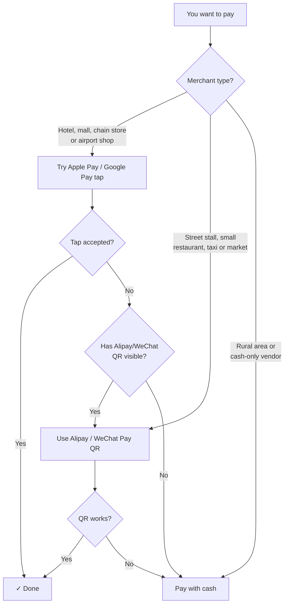

## Introduction

Here's the short version most travel blogs bury: in China, tapping your phone at a terminal is the exception, not the rule. The whole country runs on QR codes scanned through Alipay and WeChat Pay. That doesn't mean Apple Pay and Google Pay are useless for a visitor, it means they work in specific, predictable places and fail everywhere else.

This guide separates what actually functions on the ground from what you might assume based on how payments work back home. If you understand the difference before you land, you'll skip the awkward moment at a noodle counter where your beautifully provisioned phone gets a polite head shake.

## Before You Start

The key thing to understand is that Apple Pay and Google Pay are just wrappers around a card. When you tap, the terminal has to accept your underlying card network (usually Visa or Mastercard) over contactless. Chinese merchants overwhelmingly skipped card terminals and went straight to QR codes, so the number of places that can read a foreign contactless tap is limited.

### Where a phone tap tends to work

- **International-brand and business hotels** at the front desk
- **Large department stores and shopping malls** in tier-1 cities
- **Chain supermarkets and convenience stores** (not all locations)
- **Airport shops, duty-free, and some transport hubs**
- **Metro gates** in cities like Shanghai, Beijing, Guangzhou, and Shenzhen that now accept contactless foreign cards

### Where it almost never works

- Street food stalls, wet markets, and family-run restaurants
- Most taxis and many ride-hail drivers who prefer QR
- Small independent shops, tea houses, and rural businesses
- Vending machines and ticket kiosks built for domestic QR only

### Apple Pay vs Google Pay, honestly

**Apple Pay** is the more reliable of the two for a tourist. You add an eligible Visa, Mastercard, or American Express card at home, and the NFC tap itself doesn't need Google's or any blocked service to complete a transaction.

**Google Pay (Google Wallet)** is trickier. The tap uses your card network the same way, but Google services are blocked in mainland China. Add and verify your cards before you fly, and don't count on being able to fix anything inside the app once you're there. Treat it as a backup, not a plan.

### The setup that actually saves your trip

Before obsessing over contactless, do this: install **Alipay** or **WeChat Pay** and link a foreign Visa or Mastercard. Both apps now let international visitors pay by QR code across the country, and this is what unlocks the 90% of merchants that Apple Pay and Google Pay can't reach. Keep Apple Pay as your tap-friendly backup for hotels, malls, and metros.

<!-- AFFILIATE_PAYMENT -->

## Step-by-Step

1. **Provision your cards at home, on your home network.** Add your Visa, Mastercard, or Amex to Apple Pay or Google Wallet while you still have reliable, unfiltered internet. Complete any bank verification (one-time codes, app confirmation) now, not later.
2. **Tell your bank you're traveling to China.** A tap in an unfamiliar country can trigger a fraud freeze. A quick travel notice or a check of your card app's controls prevents a dead card on day one.
3. **Install Alipay or WeChat Pay and link the same card.** Follow the in-app foreign-visitor flow. This is your primary payment method; Apple Pay is the secondary one. Do this before departure if you can, since setup is smoother on an open connection.
4. **Withdraw a modest amount of cash on arrival.** A few hundred yuan in small notes covers taxis, rural stops, and terminal failures. Airport ATMs on international networks work fine.
5. **At the register, read the terminal first.** If you see a contactless wave symbol and the merchant is a hotel, mall, chain, or supermarket, try the tap. If the cashier points at a QR sticker or a scanner, switch to Alipay or WeChat Pay instead of insisting on the tap.
6. **For the metro, check the gate.** In supported cities, look for a contactless reader on the fare gate and tap your phone. If there's no reader for foreign cards, buy a single-journey ticket or use a transit QR in your payment app.
7. **Keep a fallback for every purchase.** Phone battery dies, terminals reboot, networks hiccup. Cash plus one QR app plus Apple Pay covers nearly every situation.

## Common Mistakes to Avoid

- **Assuming a tap works everywhere because your card is "contactless."** The card being contactless doesn't matter if the merchant has no terminal that reads it. Most don't.
- **Relying on Google Pay as your main method.** With Google services blocked in China, you may not be able to add cards, re-verify, or troubleshoot on the ground. Sort it out before you leave, and keep expectations low.
- **Skipping Alipay or WeChat Pay.** This is the single biggest mistake. Without a QR app you'll be locked out of street food, small restaurants, markets, and countless daily transactions no matter how many cards are in your phone.
- **Not notifying your bank.** A foreign tap flagged as suspicious can lock your card at the worst moment.
- **Carrying zero cash.** Contactless and QR fail occasionally, and rural China still leans on cash. A small buffer removes the stress.
- **Trusting one payment path only.** Redundancy is the whole strategy here: QR app first, tap second, cash third.

> ⚠️ **避坑提示：大部分中国小商户根本不支持 NFC 刷卡**。如果商家只贴了一个二维码，没有看到接触式刷卡终端，就不要掏手机刷 Apple Pay 了——刷了也没有用，直接扫 Alipay/WeChat 的二维码更快。

> 📌 **经验之谈：Google Pay 在中国是很脆弱的支付方案**。Google 服务被屏蔽后，你连在应用内查交易记录或重新验证卡片都困难。建议出发前全部配置好，入境后只用它做"最后备选"。

## Summary

Apple Pay can genuinely help you in China, but only at hotels, malls, chain stores, and some metro gates that accept contactless foreign cards. Google Pay works in the same narrow slots with the added catch that Google is blocked, so provision it fully before you arrive and lean on it lightly. The real workhorse for a tourist is Alipay or WeChat Pay linked to a foreign card, which reaches the vast QR-only majority of Chinese merchants. Set up a QR app, keep Apple Pay for taps, carry a little cash, and you'll pay smoothly almost anywhere you go.

## Read Next

- [How to Pay in China as a Tourist](/posts/how-to-pay-in-china-tourist-guide/)
- [Alipay Foreign Credit Card Step by Step](/posts/alipay-foreign-credit-card-step-by-step/)
- [where foreign credit cards work directly](/posts/use-foreign-credit-card-in-china-directly/)

