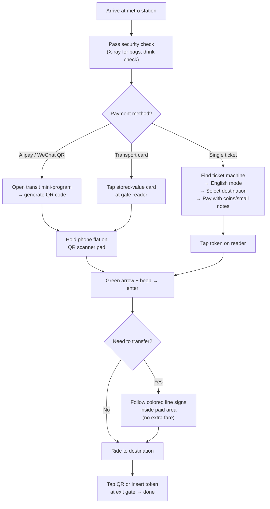

## Why This Matters

Shanghai's metro is the fastest, cheapest, and least stressful way to move around a city of 25 million people. It has more than 20 lines and over 500 stations, reaching Pudong airport, the Bund, the former French Concession, and nearly every neighborhood a visitor cares about. Taxis get stuck in traffic and drivers rarely speak English; the metro is climate-controlled, punctual to the minute, and clearly signed in English.

The part that trips up foreigners isn't the trains, it's the payment. China went almost fully cashless, and the old advice about buying paper tickets no longer matches how locals actually ride. Getting your payment sorted before you arrive at a turnstile saves you from fumbling at a machine while a queue builds behind you.

> ⚠️ **避坑提示：进站闸机扫描 QR 码时，一定要把屏幕亮度调到最高，手机平放贴在扫描板上（不是悬空举着）**。角度不对、亮度不够是 QR 码刷不过的常见问题。如果连续失败，关掉 QR 码页面重新打开刷新。

## What You Need to Know First

You have three realistic ways to pay, and they suit different types of travelers.

- **QR code via Alipay or WeChat** — the method most locals use and the one I recommend for nearly everyone. You open a transit mini-program in the app, generate a QR code, and scan it at the gate. Fares are deducted automatically based on distance.
- **Single-journey tickets** — plastic tokens or cards bought from station machines. Good if your phone is dead or you refuse to install a Chinese app. You buy one per trip.
- **Shanghai Public Transportation Card** — a physical stored-value card you top up with cash. Worth it only for longer stays, since it also works on buses, ferries, and taxis.

### Set up mobile payment before you travel

The single most useful thing you can do is install **Alipay** or **WeChat Pay** and link an international Visa or Mastercard. Both apps now accept most foreign credit cards for this purpose. Do this at your hotel on WiFi, not at the station.

- In **Alipay**, search for the "Metro" or "Transport" mini-program, select Shanghai, activate the transit code once, and you're set.
- In **WeChat**, use "Ride Code" (乘车码) and choose Shanghai Metro.

A quick caveat: linked foreign cards sometimes decline small top-ups or fail verification. Load a modest balance or complete the identity step in advance so you aren't debugging it at a gate.

<!-- AFFILIATE_TRAVEL -->

### Understand the fare logic

Fares are **distance-based**, starting at **3 yuan** for short hops and climbing by 1 yuan as you travel farther. A cross-city trip typically lands between 3 and 9 yuan. With a QR code the system calculates this for you between the gate you enter and the gate you exit, so you never guess an amount.

## How It Works in Practice

Here's the full flow from street to platform, in order.

1. **Find the entrance.** Look for the red metro logo (a stylized "M"). Larger stations have many numbered exits, so note which one you need on the way out.
2. **Clear security.** Put bags on the X-ray belt. It's fast and routine. Don't be surprised if a guard asks you to sip from an open drink bottle.
3. **Enter the gate.**
   - *QR code:* open your transit code in Alipay or WeChat, set screen brightness high, and hold the phone flat against the scanner (usually a slanted pad near the top of the gate). Wait for the beep and green arrow.
   - *Single ticket:* buy from a machine first, switch it to English, pick your destination station on the map, pay by coins, small notes, or QR, then tap the token on the reader.
4. **Follow the colored line signs.** Every line has a number and a color. Signage repeats the line color overhead, so you rarely need to read Chinese.
5. **Board and track your stops.** Onboard screens and announcements are bilingual. Doors on the correct side light up before opening.
6. **Transfer if needed.** At interchange stations, follow signs for your next line's number and color. You stay inside the paid area, so no extra tap or payment. Some transfers involve long underground walks, so give yourself a minute or two.
7. **Exit.** Tap or scan again at the exit gate. This is when the distance-based fare is finalized. If you used a single-journey token, the machine swallows it here.

### A note on transfers

Some interchange stations are enormous. People's Square, where Lines 1, 2, and 8 meet, can involve a five-minute walk between platforms. Follow the overhead line-number signs rather than trying to memorize a map, and you'll get there.

## Troubleshooting

**The QR scanner won't read my phone.** Raise your screen brightness, close and reopen the transit code so it refreshes, and lay the phone flat on the pad rather than holding it at an angle. A cracked screen protector can also block the scan.

**My foreign card won't link in Alipay or WeChat.** Try the other app, since acceptance varies by card issuer. If both fail, buy single-journey tickets with cash while you sort it out, or top up a physical transport card.

**I tapped in but my phone died before I could tap out.** Go to the staffed service window near the gates. Staff can help you exit, though you may pay a maximum fare. Keep a little cash as backup.

**I got on the wrong line.** No penalty for staying inside the system. Ride to the next interchange, cross to the correct platform, and continue. You only pay based on entry and exit points.

**The station is packed at rush hour.** Peak times are roughly 7:30–9:30 AM and 5:30–7:30 PM. Trains come every couple of minutes, so let a full one go rather than cramming in. Avoid Line 1 and Line 2 through the center if you can shift your timing.

## Final Tips

The Shanghai Metro is genuinely one of the easiest big-city subways in the world for a non-Chinese speaker, once your phone is set up to pay. Sort out Alipay or WeChat on hotel WiFi before your first ride, keep about 50 yuan in coins and small notes as a fallback, and note your exit number so you don't surface on the wrong side of a huge intersection. Screenshot your route or use an offline map, follow the color-coded signs, and you'll be transferring across the city like a local by day two.

## Read Next

- [Shanghai city guide](/posts/shanghai-city-guide-for-foreigners/)
- [airport to city transport guide](/posts/airport-to-city-transport-beijing-shanghai-guangzhou/)
- [Alipay setup guide](/posts/alipay-foreign-credit-card-step-by-step/)

